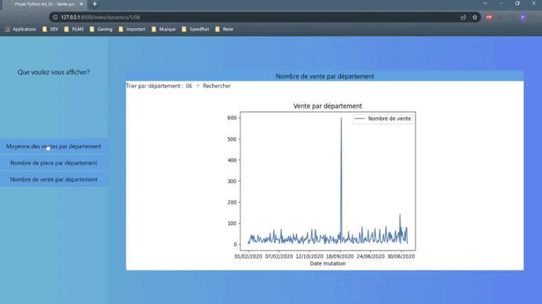

<h1 align="center">
  
</h1>

---

# Analyse des valeurs foncières Française en 2020

## Petit résumé

- La valeur foncière est la valeur d’un terrain. Elle est le plus souvent analysée en fonction de son potentiel de construction futur. Ce projet analyse les biens immobiliers français en 2020.

## Objectifs

- Réaliser une étude des biens immobiliers Français.
- Réaliser une API Django.

## Techno

- Python
- Jupyter
- Django

- HTML
- CSS
- Tailwind

## API

## Auteur

- [@Pierre](https://github.com/Pierre-Portfolio)
- [@Tom](https://github.com/Flaye)
